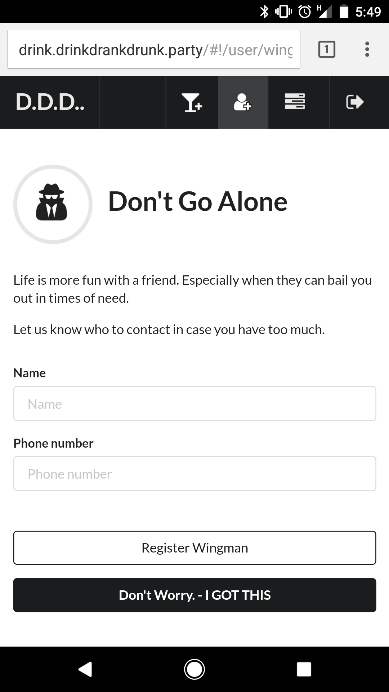

#Drink Drank Drunk - Drank Front End
This repo is the head repo for the DrinkDrankDrunk project at Boilermake2017. <br>
https://github.com/Doolan/DripDrankDrunkFE <br>
https://github.com/Doolan/DripDrankDrunkMoblie <br>
https://github.com/Doolan/DripDrankDrunkBE

_Created By Steven Doolan, Ben Brubaker, Dylan Vener, and Ben Efron_

## Yes this Hack is a Drinking App BUT ...
It does more than encourage people to drink. It attempts to provide and a opening for reflection on drinking habits. 

## The Drink Drank Drunk Eco-System
The Drink Drank Drunk Eco-System is a collection of unified apps that share a rest api and a  purpose.

###[Drank](http://drank.drinkdrankdrunk.party/)
is an Data visulization and experimentation tool designed to help the user reflect on their past drinking trends. Users can get help remembering past nights by reviewing their changing BAC content through the course of the drinking. They then take one step and compare the current week against average drinks for drinking. 

Guided with this new perspective, they can step further back, predict alcohol expenses, and view the impact a full month of drinking can have on them.


###[Drink](http://drink.drinkdrankdrunk.party/)
targets the drinking portion of alcohol consumption. 
It tracks your BAC thought the night by allowing the user to log drinks with a single button press. Users can monitor their rising BAC levels (estimated) and take approate action. Drink also encourages drinkers to add a friend or Wingman to their list so Drink can notify them in case of over consumption and serious risk to self or others. 

###Drunk
is refrenced the other applications, but details are still underwraps and development is on going with early release coming soom.




###Frontend Set Up
```bash
git clone clone git@github.com:Doolan/DripDrankDrunkFE.git
cd ----
npm install #installs all of the packages
npm start #launches the site on http://localhost:3000/
```
###_Required Tools_
_Install these first_

1. [Node.js](https://nodejs.org/en/)
2. [Git](https://desktop.github.com/)
3. nodemon
```bash
npm install -g nodemon
```